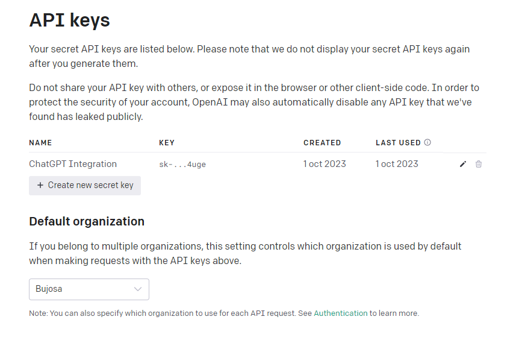
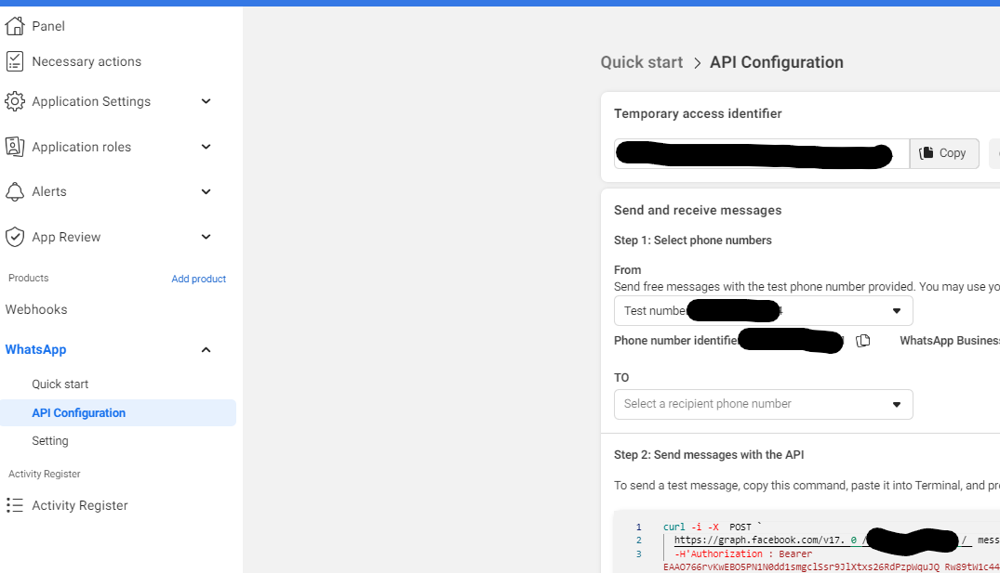

# azha

This is a simple project related with ChatGPT

## How to use

### 1. Install dependencies

```bash
pip install -r requirements.txt
```

### 2. Run the server

```bash
python __init__.py
```

## Documentation

### Create ChatGPT Application API

1. Go to [Openai Platform](https://platform.openai.com/account/api-keys) and create the new secret key.
2. Put this key in constants.py file.

   

```python
OPENAI_API_KEY = "YOUR_API_KEY"
```

### Create FaceBook Application

1. Go to [Facebook for Developers](https://developers.facebook.com/) and create a new application.
2. Select the category of the application in this case is Business and give it a name.
3. Add name and email to the test user.
4. Go the WhatsApp Configuration and add the webhook url and the token.
5. You can have your temporal token for send message to the user look the next image.

   

### (Optional) hosting the server

You can host the server in whatever you want, but if you want to host it in Heroku follow the next steps:

Go to [Heroku](https://www.heroku.com/) and create a new application.

See the [documentation](https://devcenter.heroku.com/articles/getting-started-with-python) to deploy the application.

### (Optional) Create your local environment

1. In this case we are using ngrok to expose our local server to the internet.
2. Download ngrok from [here](https://ngrok.com/download).
3. Unzip the file and run the following command:

```bash
./ngrok http 5000
```
